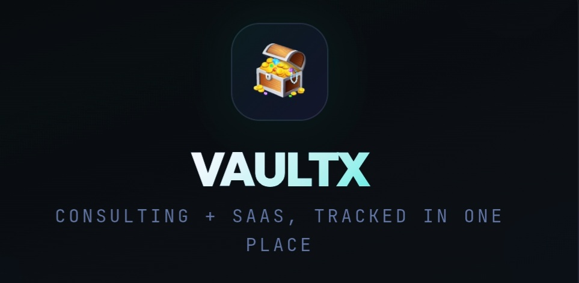

# Vaultx 🪎

  

An operating system for tracking revenue across Monetized SaaS Products and Earnings from Research & Consulting

---
# Use Case

VaultX is a hobby yet useful personal product for tracking earnings and expenses across internet businesses that include
- SaaS Product Distribution
- Research and Consulting
- Software Design & Developmenf
- Other Freelancing Projects

----
# Stacks
VaultX is python-first and built with Streamlit + Google Sheet to mirror a production app

---
## 🔗 Live System

👉 **[Try the Live App Here](https://vaultx.streamlit.app/)**

